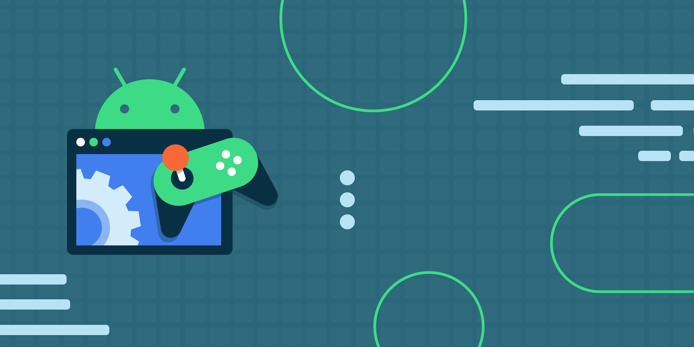

*Look beyond the lines itself, and see the beauty they create*

## Where my passion comes from: 

To me, software engineering is more than just coding, it is also art. My interest in the creative design of websites always intrigued me. Growing up, I loved all forms of art, whether it was traditional, abstract and open to interpretation, or digital and presentable. I found myself always putting the effort in presentations that I would show to others, or submit as work. While working, I feel I could imagine the end result, following the process, and constantly editing until it could be great enough to present and I would be proud of it. 

Software engineering has that same motivation for me. I want to design software that not only I could be proud of, but anyone who comes across it would be proud too. I believe that applications should also be very convenient and understandable for anyone using it. Considering I was born and raised in a time where technology was most prominent, I understand what it’s like using the internet, browsing through websites, and all its struggles. I want to be part of that contribution to make applications understandable, convenient, all the while pleasing to look at. 

## The goals for future me:

*A journey lies ahead*

For the future, as I continue to pursue my degree, a technical skill I hope to build on and improve upon are my efficiency in various languages. I only know a few right now, but I know that understanding more can really add diversity to a skillset and make me more available. As for more practical skills, I want to develop the cooperative capability to work in any team environment and do my part in making sure the team succeeds and reaches its goals. Within that team, I also want to create relationships that are built on supporting one another and where feedback can help everyone improve. 

As for the experiences as I move forward, I hope to be a part of more outside opportunities other than just academic and in-school activities. I realize that where school teaches you technical skills and expectations, outside opportunities like internships will give me the fundamentals of the real world. These are things such as teamwork, client-oriented assignments and instructions, and coding that not only I should be able to read and understand, but allow others to build on it too. 

*But why game development for me?*

An overall goal I want to achieve is to be in game development. I look at software engineering and don’t just think of the lines of text, or implemented back-end algorithms, I think of games. Game development not only has the graphics and designs to create new worlds and experiences, it also has in-depth stories and purposes, all with interactions between the game maker's characters and players. Finally, games also have a community for players built on the same appreciation they have for the game.
