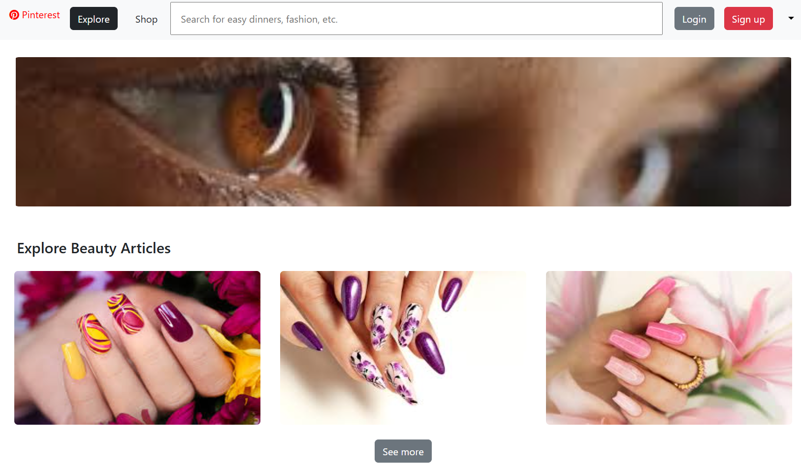
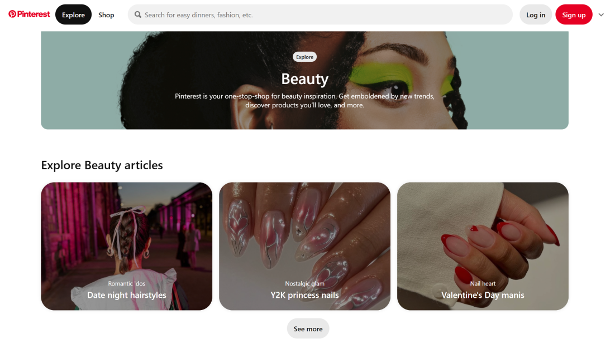

### Just what are Frameworks?

For those who may not be familiar with UI designing or web page creation, UI Frameworks can be reimagined as a library. 
A library where you can pick and use defined structures to keep the process simple. 

To give a more concrete comparison, especially if you are more familiar with regular programming languages like Javascript, 
Java, or C, the library is similar to importing predefined functions or data structures with its own operators. 

Now, perhaps we can all agree that if we didn’t have predefined things at our disposal, that means creating it ourselves. 
As a result, creating what we normally create would take even longer if we didn’t have those. 

The learning curve to learn a method’s parameters and its behavior, or the time behind reading a data structure’s  documentation 
and understanding its limitations, is worth more than implementing those yourselves. 

So, the same could be said for learning frameworks like Bootstrap 5. It may take a while understanding the format, the terms, the 
different classes, and how they all behave all together. However, that beats the time trying to figure those out, plus, creating 
the raw code in CSS and HTML yourself. 

### My personal experience with raw CSS and HTML:

Before learning about Bootstrap 5, I attempted creating a website on my own. That was through pure CSS and HTML. An experience 
like that is something only someone who has gone through the same thing can understand. 

Creating tags and adding text is one thing. It’s not difficult to create a webpage that directly reads from top to bottom, all with 
headings, titles, subsections and paragraphs. 

That is, however, how you make sure no one will enjoy looking at your work. 

If you want something to be proud of, you must style the web page and make it interesting. 

I put so much time into learning how to create sections that didn’t read top to bottom, but instead used columns. Then, I put even more 
time into making sure images don't just sit on top of text, but include itself in the paragraph. 

There’s even more to consider. There’s the different spacing in between paragraphs, using the right margins, paddings, or borders. Other 
than visuals, there’s also buttons that are interactive, or links that take you somewhere, input bars, and so much more.

Even then after all that time, my page still didn’t look great and anywhere near the common websites you’d see online. 

Overall, that experience was very time consuming. The different components itself may not seem hard, but putting them all together 
definitely was. 

### My personal experience with Bootstrap 5:

It all changed when I started learning how to use Bootstrap 5. 

Creating websites never felt so smooth. By just choosing the right class created by Bootstrap, components in the page were already determined. 

There were navigation bars, buttons that were interactive with dropdowns or inputs, and even splitting the page into grids with the 
right spacing and space in between the other pieces. 

Sure I had to learn and spend time reading what things did and how to use them correctly, but everything I needed to know was right on the 
documentations. The experience was no different than learning to use interfaces and functions for programming. It was definitely faster than 
if I had to do it myself. 

My website in the end, though not the best, is still better than anything I could have created just on my own. 

If there was something to learn from this whole experience, it would be that Frameworks like Bootstrap 5 are worth learning because the 
time you save is incredible. 

Here is my recreation of the Pinterest explore page with Bootstrap 5 and minimal of my own style edits:

Versus the original: 

