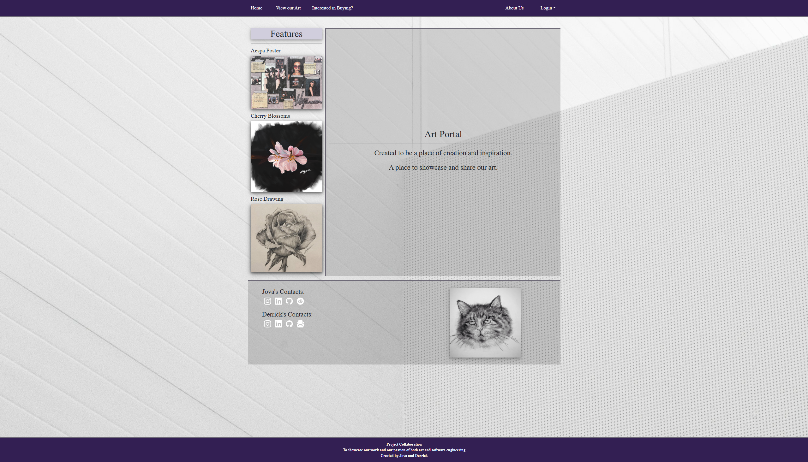

<pre>
  
  Overview:
  
    This website is designed to showcase not just skills with web development, but also my skills in my hobby, which is art. 
    At the same time, I also wanted to take this opportunity to allow those who visit the website a chance to request anything from us as work.

  My Contributions:

    This was a 2 person collaboration between my friend and I who is also majoring in computer science, but in another college. 

    Some of my contribution would be:

      Front-End:
        Homepage, View page, and request pages

      Back-End:
        Making the commission requests possible for people to submit
        
  What I Learned:
  
    I decided to start this project after completing my semester which has ICS 314, which is Software Development. I wanted to 
    do something that didn't feel like a class project.

    I definitely solidified my skills in HTML and CSS more because now I can confidently fix styling problems as well as know what 
    kind of solutions I need.

    Most importantly, I learned to create styling that is inclusive to all screen sizes, not just big screens.
  
</pre>

[Visit the deployed website](https://art-portal-azure.vercel.app/)

