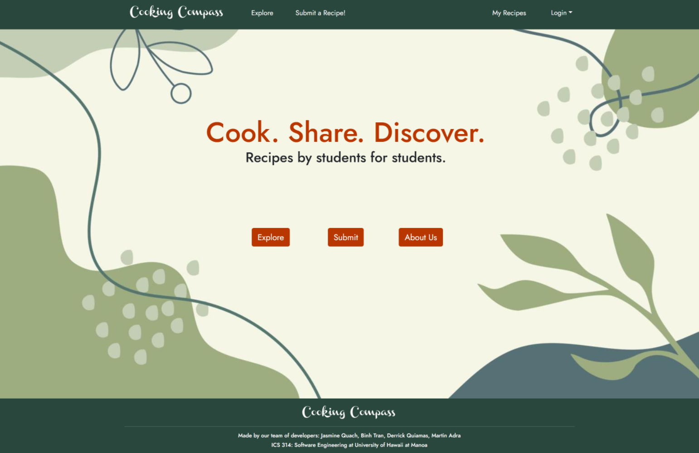

<pre>
  
  Overview:
  
    Cooking Compass is an application that allows UH Mānoa students to share and search for creative recipes that respect the
    constraints—limited kitchen resources, cooking skills, time—many college-goers face. By providing opportunites to find
    creative, doable recipes, this project aim to foster a community that celebrates resourcefulness, healthy eating, and the 
    joy of cooking.

  My Contributions:

    This was a 4-person group project for ICS 314 that was broken into 3 milestones. For each milestone there was lists of
    required tasks that must be completed. We were able to keep track of everything using a combination of github project,
    issue driven management, as well as our own personal documents and to-do lists.

    The tasks I completed are the following:

      Front End: 
        Homepage and About Page layout which includes a navigation bar with links to the various pages, as well as the footer.
        Explore page and My Recipe page, along with proper sizing for the card components
        I also created the page layout for Submit Reports page and Edit Recipe page

      Back End: 
        For the search bar, it correctly reads the desired search and filters all recipes by their titles, instructions, 
        and descriptions
        By using prisma and SQL, submitting a report correctly stores the data in a report database table
        The My Recipe page correctly reads from the recipes database and only displays recipes based on the current user's
        recipes
        Within the My Recipe page it also allows the user to edit and delete recipes
        
  What I Learned:
  
    Front End Development:
      This experience helped solidify my understanding of using React and Bootstrap as well as CSS styling to create front end
      pages that are appealing to look at. 

    Back End Development:
      By using PostgreSQL and Next.js, it helped me develop my skills in reading and writing to a database based on user
      interactions with the front end application.
  
</pre>

[Visit the project homepage](https://cooking-compass.github.io/)
[Visit the Github Organization page](https://github.com/Cooking-Compass)

