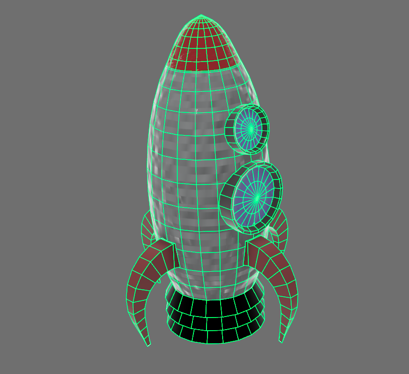
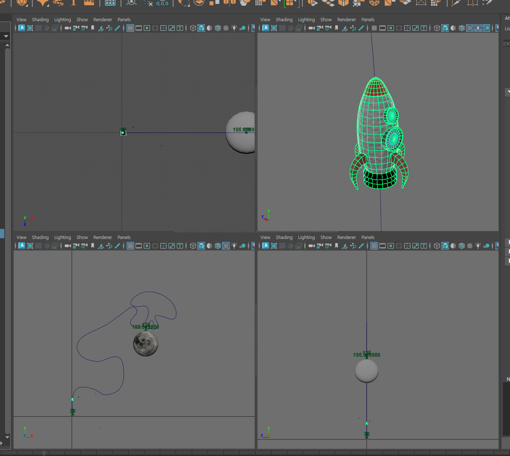

<pre>
  
  For this project I learned the fundamentals of Maya to be able to create, light, and animate.
  Specifically, I learned these skills:
    - Poly Modelling
    - Lighting
    - Material Customization and Assignment
    - Key Frame Animation for Objects
    - Camera/Perspective Animation
    - Motion Path Animation
  
</pre>

  First photo is an upclose photo of the rocket I 3D modelled.

 

  Second photo is the entire scene from flat view (back, front, side) which shows the motion path and other objects I modelled.

