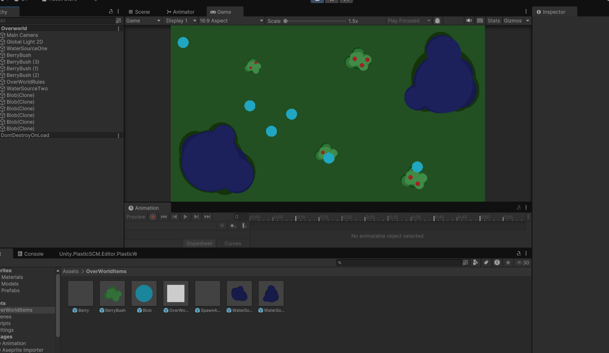

<pre>
  
  I wanted to try creating a very simple simulation of an ecosystem that mimics organisms that needed to eat and drink to stay alive.
  I also wanted to better my C# scripting skills that went beyond syntax. 
  Other than syntax, by doing this project I was able to learn:
    - Connect scripts to GameObjects so that each object behaved accordingly
    - Reference stats and data fields across objects and update/read/write to those fields as a result of actions done in the simulation
        - For example: upon collision of two 'Blobs,' compare strength stats and the stronger one kills the weaker one
    - Use script not just for behavior (like movement and stat comparison), but also use it for sprite/assets
        - For example: using a script to show berry growth through 3 different stages using colors
  
</pre>
[Visit the project repository](https://github.com/derriqk/UnitySimulation)
 
 

