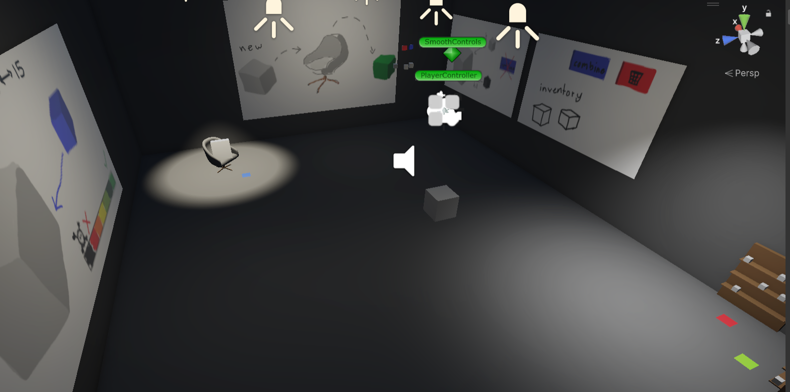
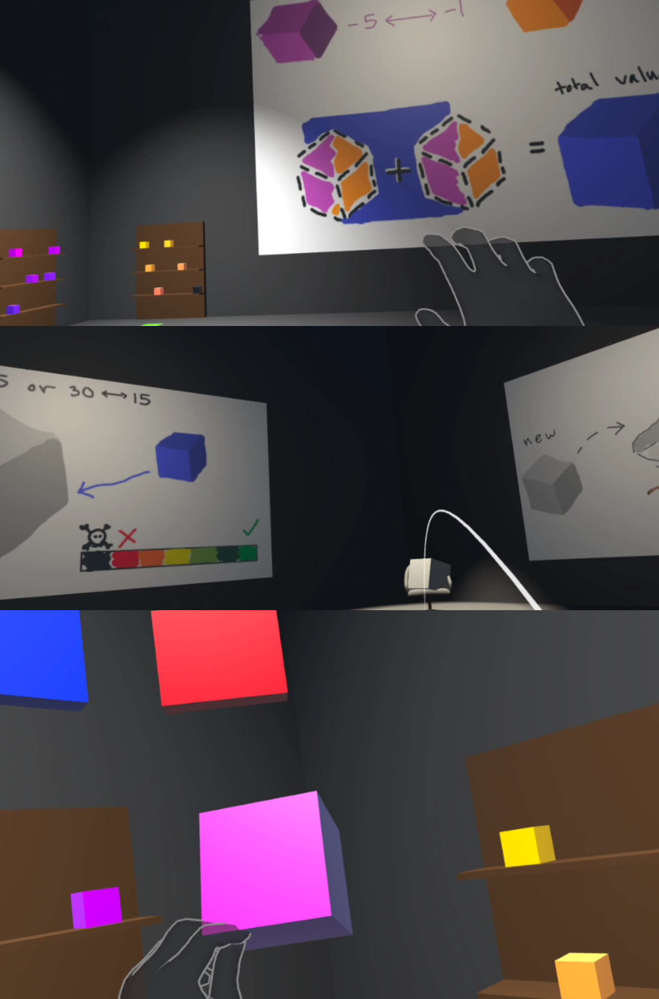

<pre>
  
  I developed the core system for a flexible and extensible VR program that can easily adapt to new assets and gameplay scenarios.
  The project demonstrates combining and interacting with 3D objects—such as merging items and observing outcomes—to simulate real-world applications.
  In the prototype, this concept is illustrated through combining medicine, administering it to a patient, and visualizing the results as a learning tool.

  Throughout this project, I gained hands-on experience with the Meta XR API and strengthened my problem-solving skills in VR interaction design.
  I also learned key 3D programming principles, including vector manipulation, lighting, collisions, and trigger-based logic.
  
</pre>
[Visit the project repository](https://github.com/derriqk/VRProj)
 
[View a demo of this project](https://www.youtube.com/watch?v=H6u22j0zQTM)
 
 

